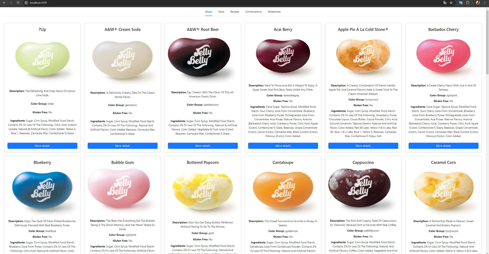

# Jelly Beans App

This is a React application that displays various information about jelly beans using the [Jelly Belly Wiki API](https://jelly-belly-wiki.netlify.app/). The application includes several sections: Beans, Facts, Recipes, Combinations, and Milestones. Each section is presented as a tab in the application.

## Features

-   Display a list of beans with infinite scrolling.
-   View detailed information about each bean in a modal.
-   Display a list of facts, recipes, combinations, and milestones.
-   View detailed information about each fact, recipe, combination, and milestone in a modal.
-   Tabs are fixed at the top of the page when scrolling.

## Screenshot



## Technologies Used

-   React
-   TypeScript
-   Ant Design
-   CSS

## Getting Started

To get a local copy up and running follow these simple steps.

### Prerequisites

You need to have Node.js and npm installed on your machine. You can download Node.js and npm from [here](https://nodejs.org/).

### Installation

1. Clone the repository:

    ```bash
    git clone https://github.com/JohnImril/jelly-beans.git
    cd jelly-beans
    ```

2. Install NPM packages:

    ```bash
    npm install
    ```

3. Run the application:

    ```bash
    npm start
    ```

The app will be available at `http://localhost:3000`.

## Project Structure

```plaintext
jelly-beans/
├── public/
├── src/
│   ├── components/
│   │   ├── BeanList/
│   │   │   ├── BeanList.tsx
│   │   │   └── BeanList.css
│   │   ├── FactList/
│   │   │   ├── FactList.tsx
│   │   │   └── FactList.css
│   │   ├── RecipeList/
│   │   │   ├── RecipeList.tsx
│   │   │   └── RecipeList.css
│   │   ├── CombinationList/
│   │   │   ├── CombinationList.tsx
│   │   │   └── CombinationList.css
│   │   ├── MilestoneList/
│   │   │   ├── MilestoneList.tsx
│   │   │   └── MilestoneList.css
│   ├── App.tsx
│   ├── index.tsx
│   └── react-app-env.d.ts
├── package.json
└── README.md
```

## API Endpoints

The application uses the following API endpoints:

### Beans

-   GET /api/beans: Retrieves a paginated list of beans.
-   GET /api/beans/:id: Retrieves detailed information about a specific bean.

### Facts

-   GET /api/facts: Retrieves a paginated list of facts.
-   GET /api/facts/:id: Retrieves detailed information about a specific fact.

### Recipes

-   GET /api/recipes: Retrieves a paginated list of recipes.
-   GET /api/recipes/:id: Retrieves detailed information about a specific recipe.

### Combinations

-   GET /api/combinations: Retrieves a paginated list of combinations.
-   GET /api/combinations/:id: Retrieves detailed information about a specific combination.

### Milestones

-   GET /api/milestones: Retrieves a paginated list of milestones.
-   GET /api/milestones/:id: Retrieves detailed information about a specific milestone.

## Contributing

Contributions are what make the open-source community such an amazing place to learn, inspire, and create. Any contributions you make are greatly appreciated.

-   Fork the Project.
-   Create your Feature Branch (git checkout -b feature/AmazingFeature).
-   Commit your Changes (git commit -m 'Add some AmazingFeature').
-   Push to the Branch (git push origin feature/AmazingFeature).
-   Open a Pull Request.

## License

Distributed under the MIT License. See LICENSE for more information.

## Contact

Nikita - john.maks595@gmail.com


